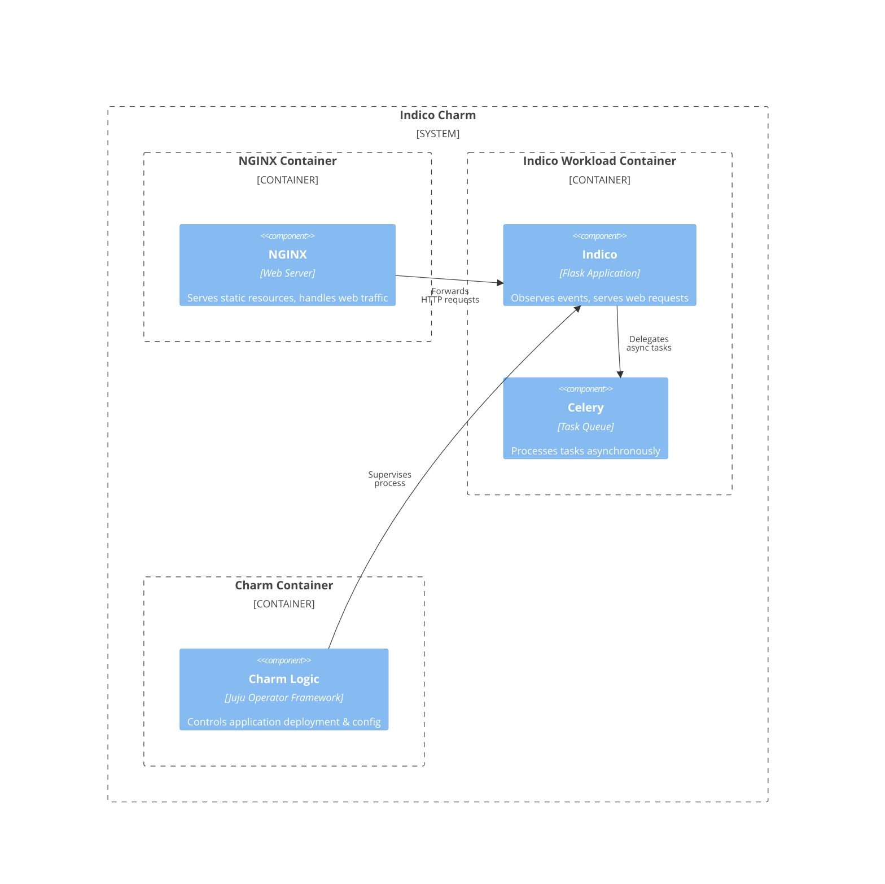

# Charm architecture

At its core, [Indico](https://getindico.io/) is a [Flask](https://flask.palletsprojects.com/) application that integrates with [PostgreSQL](https://www.postgresql.org/), [Redis](https://redis.io/), and [Celery](https://docs.celeryq.dev/en/stable/).

## Charm architecture diagram

Below is a diagram of the application architecture of Indico.



The charm design leverages the [sidecar](https://kubernetes.io/blog/2015/06/the-distributed-system-toolkit-patterns/#example-1-sidecar-containers) pattern to allow multiple containers in each pod with [Pebble](https://juju.is/docs/sdk/pebble) running as the workload container’s entrypoint.

Pebble is a lightweight, API-driven process supervisor that is responsible for configuring processes to run in a container and controlling those processes throughout the workload lifecycle.

Pebble `services` are configured through [layers](https://github.com/canonical/pebble#layer-specification), and the following containers represent each one a layer forming the effective Pebble configuration, or `plan`:

1. An [NGINX](https://www.nginx.com/) container, which can be used to efficiently serve static resources, as well as be the incoming point for all web traffic to the pod.
2. The [Indico](https://getindico.io/) container itself, which has a [uWSGI](https://uwsgi-docs.readthedocs.io/en/latest/) server configured in HTTP mode.


As a result, if you run a `kubectl get pods` on a namespace named for the Juju model you've deployed the Indico charm into, you'll see something like the following:

```bash
NAME                             READY   STATUS    RESTARTS   AGE
indico-0                         3/3     Running   0         6h4m
```

This shows there are 3 containers - the two named above, as well as a container for the charm code itself.

And if you run `kubectl describe pod indico-0`, all the containers will have as Command ```/charm/bin/pebble```. That's because Pebble is responsible for the processes startup as explained above.

## OCI images

We use [Rockcraft](https://canonical-rockcraft.readthedocs-hosted.com/en/latest/) to build OCI Images for Indico and NGINX. 
The images are defined in [NGINX ROCK](https://github.com/canonical/indico-operator/tree/main/nginx_rock/) and [Indico ROCK](https://github.com/canonical/indico-operator/tree/main/indico_rock).
They are published to [Charmhub](https://charmhub.io/), the official repository of charms.
This is done by publishing a resource to Charmhub as described in the [Juju SDK How-to guides](https://juju.is/docs/sdk/publishing).

## Containers

Configuration files for the containers can be found in the respective directories that define the ROCKs, see the section above.

### NGINX

This container is the entry point for all web traffic to the pod (on port `8080`). Serves some static files directly and forwards non-static requests to the Indico container (on port `8081`).

The reason for that is since NGINX provides cache static content, reverse proxy, and load balance among multiple application servers, as well as other features it can be used in front of uWSGI server to significantly reduce server and network load.

The workload that this container is running is defined in the [NGINX ROCK](https://github.com/canonical/indico-operator/tree/main/nginx_rock/).

### Indico

Indico is a Flask application run by the uWSGI server, one of the most popular servers for these applications.

The uWSGI server is started in HTTP mode (port `8081`) serving Indico Application so NGINX can forward non-static traffic to it.

The workload that this container is running is defined in the [Indico ROCK](https://github.com/canonical/indico-operator/tree/main/indico_rock).

### Celery

The Celery is used to process tasks asynchronously created by the Indico application such as sending e-mails, survey notifications, event reminders, etc.

Celery runs in the same container as the Indico container, as defined in the [Indico ROCK](https://github.com/canonical/indico-operator/tree/main/indico_rock).

## Metrics
Inside the above mentioned containers, additional Pebble layers are defined in order to provide metrics.

### NGINX Prometheus exporter

Inside the NGINX container, the  [NGINX Prometheus Exporter](https://github.com/nginxinc/nginx-prometheus-exporter) runs to provide statistics on web traffic.

It is started with `-nginx.scrape-uri=http://localhost:9080/stub_status` , which has been configured in the NGINX container to return NGINX's [stub_status](http://nginx.org/en/docs/http/ngx_http_stub_status_module.html). 
The exporter listens on port `9113` and metrics about web traffic to the pod can be scraped by Prometheus there.

### StatsD Prometheus exporter

Inside the Indico container, the [StatsD exporter](https://github.com/prometheus/statsd_exporter) runs to collect [statistics](https://uwsgi-docs.readthedocs.io/en/latest/PushingStats.html) from uWSGI runs.

The `StatsD Prometheus Exporter` listens on ports:

- `9125`: UDP address on which to receive statsd metric.
- `9102`: expose the web interface and generated Prometheus metrics. The metrics can be scraped by Prometheus here.

### Celery Prometheus exporter

Inside the Indico container, the  [Celery Exporter](https://github.com/danihodovic/celery-exporter) runs to collect metrics from Celery.

The `Celery Exporter` is started with:

- `--broker-url=`: scrape metrics from the Redis (broker) container.
- `--retry-interval=5`: retry after 5 seconds in case of errors communicating with the broker.

Since Indico Celery serializers are set to work with [Pickle](https://docs.python.org/3/library/pickle.html) instead of [JSON](https://www.json.org/), the environment variable `CE_ACCEPT_CONTENT` is set to `"json,pickle"` so the exporter will be able to read the data.

The `Celery Exporter` listens on port `9808` and metrics about Indico Celery tasks can be scraped there by Prometheus.

The Grafana dashboard is the same available [here](https://grafana.com/grafana/dashboards/17508-celery-tasks-by-task/).


## Integrations

### Grafana

Grafana is an open-source visualization tool that allows to query, visualize, alert on, and visualize metrics from mixed datasources in configurable dashboards for observability. This charm is shipped with its own Grafana dashboard and supports integration with the [Grafana Operator](https://charmhub.io/grafana-k8s) to simplify observability.

### Ingress

The Indico charm also supports being integrated with [Ingress](https://kubernetes.io/docs/concepts/services-networking/ingress/#what-is-ingress) by using [NGINX Ingress Integrator](https://charmhub.io/nginx-ingress-integrator/).

In this case, an existing Ingress controller is required. For more information, see [Adding the Ingress Relation to a Charm](https://charmhub.io/nginx-ingress-integrator/docs/adding-ingress-relation).

### PostgreSQL

PostgreSQL is an open-source object-relational database used by Indico as a source of all the data needed for its goal: event organization, archival, and collaboration.

### Prometheus

Prometheus is an open-source system monitoring and alerting toolkit with a dimensional data model, flexible query language, efficient time series database, and modern alerting approach. This charm is shipped with a Prometheus exporter, alerts, and support for integrating with the [Prometheus Operator](https://charmhub.io/prometheus-k8s) to automatically scrape the targets.

### Redis

Redis is an open-source in-memory data structure store used here as two independent containers:

1. Cache backend: Copies of frequently accessed data are stored and used if satisfy the request. Otherwise, the application will handle it. This configuration helps to reduce the number of queries and improve response latency.
2. Message broker: Used for communication between Indico and the Celery background workers.

> **Warning**
> If you redeploy Indico with a fresh database, you must also remove the Redis cache from the previous deployment. 
> The Redis cache holds the session data, and if you don't remove it, [session hijacking](https://github.com/indico/indico/issues/5901) 
> may be possible if the user id of the old deployment matches the user id of the new deployment.
 
## Juju events

Accordingly to the [Juju SDK](https://juju.is/docs/sdk/event): "an event is a data structure that encapsulates part of the execution context of a charm".

For this charm, the following events are observed:

1. [<container name>_pebble_ready](https://canonical-juju.readthedocs-hosted.com/en/latest/user/reference/hook/#container-pebble-ready): fired on Kubernetes charms when the requested container is ready.
Action: wait for the integrations, and configure the containers.
2. [config_changed](https://canonical-juju.readthedocs-hosted.com/en/latest/user/reference/hook/#config-changed): usually fired in response to a configuration change using the CLI.
Action: wait for the integrations, validate the configuration, update Ingress, and restart the containers.
3. [database_relation_joined](https://github.com/canonical/ops-lib-pgsql): for when the PostgreSQL relation has been joined.
Action: if the unit is the leader, add the extensions [`pg_trgm:public`](https://www.postgresql.org/docs/current/pgtrgm.html) and [`unaccent:public`](https://www.postgresql.org/docs/current/unaccent.html).
4. [leader_elected](https://canonical-juju.readthedocs-hosted.com/en/latest/user/reference/hook/#leader-elected): is emitted for a unit that is elected as leader.
Action: guarantee that all Indico workers have the same [secret key](https://docs.getindico.io/en/latest/config/settings/?highlight=secret_key#SECRET_KEY) that is used to sign tokens in URLs and select a unit to run Celery.
5. [master_changed](https://github.com/canonical/ops-lib-pgsql): PostgreSQLClient custom event for when the connection details to the master database on this relation change.
Action: Update the database connection string configuration and emit config_changed event.
6. [redis_relation_changed](https://github.com/canonical/redis-k8s-operator): Fired when Redis is changed (host, for example).
Action: Same as config_changed.
7. [refresh_external_resources_action](https://charmhub.io/indico/actions): fired when refresh-external-resources action is executed.
8. [indico_peers_relation_departed](https://canonical-juju.readthedocs-hosted.com/en/latest/user/reference/hook/#endpoint-relation-departed): fired when a Indico unit departs. Action: elect a new unit to run Celery on if the departed unit was running Celery and replans the services accordingly.

## Charm code overview

The `src/charm.py` is the default entry point for a charm and has the IndicoOperatorCharm Python class which inherits from CharmBase.

CharmBase is the base class from which all Charms are formed, defined by [Ops](https://juju.is/docs/sdk/ops) (Python framework for developing charms).

See more information in [Charm](https://canonical-juju.readthedocs-hosted.com/en/latest/user/reference/charm/).

The `__init__` method guarantees that the charm observes all events relevant to its operation and handles them.

Take, for example, when a configuration is changed by using the CLI.

1. User runs the command
```bash
juju config indico_no_reply_email=sample@domain.com
```
2. A `config-changed` event is emitted
3. In the `__init__` method is defined how to handle this event like this:
```python
self.framework.observe(self.on.config_changed, self._on_config_changed)
```
4. The method `_on_config_changed`, for its turn,  will take the necessary actions such as waiting for all the relations to be ready and then configuring the containers.
